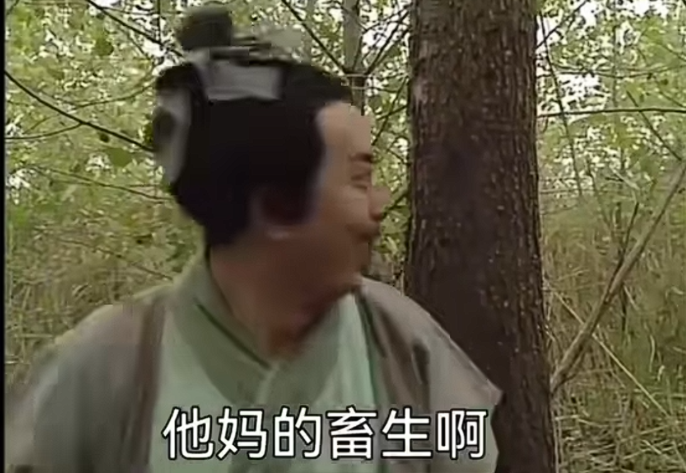

踏马的终于放假了啊！！！！！！

---

## 高三三班v.s.奶龙

北高峰回来后，班里多了一头奶龙。它一开始只是静静地顶着天花板，直到它肚子扁了下去。

它变得不太安分了。没准它想吃东西，于是把头顶在灯上，合成孔明灯。

某一节晚自修下课，mjw把奶龙拴在自己的眼镜上。然后一个邪恶的想法就在我的脑袋中诞生了。

我把笔拴在了奶龙上。奶龙沉底，于是我把笔拔了，剩下一只笔盖。物理课上有通过小球+滑轨实现前进的实验，我也想通过摆动笔盖的方式让奶龙自行前进。然而，这只奶龙开始乱飘，不一会儿，在众人的合力纠正下，这只笔盖命中了wzx的脸。<mark style="background: #ADCCFFA6;">诶对了，这只笔是jyx的。
</mark>

---

无独有偶。

喂！我在看你呢！

---

在金中的两位好同学的要求下，学校又安排了一次考试。下面是mcw阅卷看到的答案。

> [!NOTE] 注意
> 本条屏蔽当事人。

---

春考查分的那一刻激动地差点跳起来。回到学校后才发现自己考了一大坨。<mark style="background: #ADCCFFA6;">但是该放还是放吧</mark>（；´д｀）ゞ

---

周五放学后，有人在与柚子玩耍时，不小心被柚子单杀了。于是一只柚子出现在他的桌上。

---

这次美食节怎么给了那么多券。整整100。更糟糕的是，xby要去打球，把他的券全给我了。第一次遇到怎么花都花不光券的美食节。（jyx手里更多，300，只能直接送掉了100）这么像乌托邦的时候，却还是有人被一首卡门序曲送走了。

下午去参观了一些神秘打野点，获得了<mark style="background: #FF5582A6;">君临天下</mark>的成就（似乎不是吃一个<mark style="background: #FFF3A3A6;">附魔金苹果</mark>），同时在柘湖书院里找到了秘密出口。

晚上听~~体育馆里的破烂广播~~演唱会，虽然一直听不出歌词是什么，但还是有一些唱的很好听的:D
